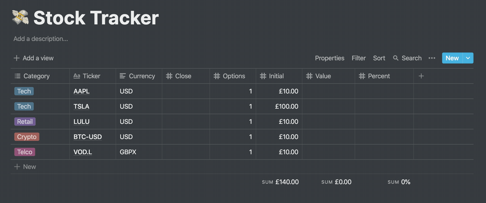
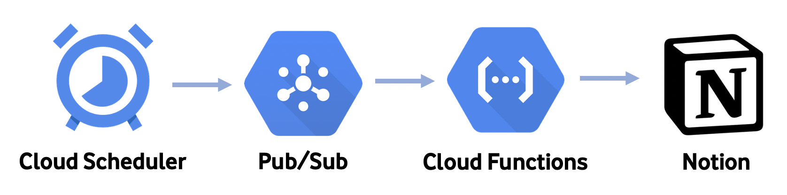
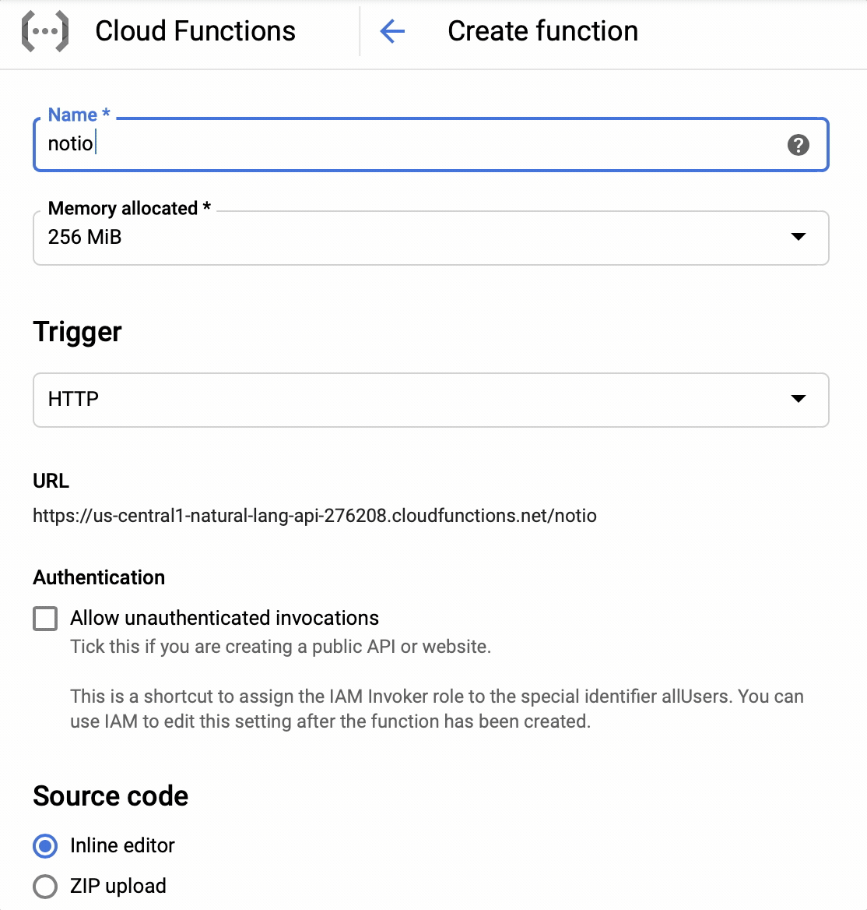
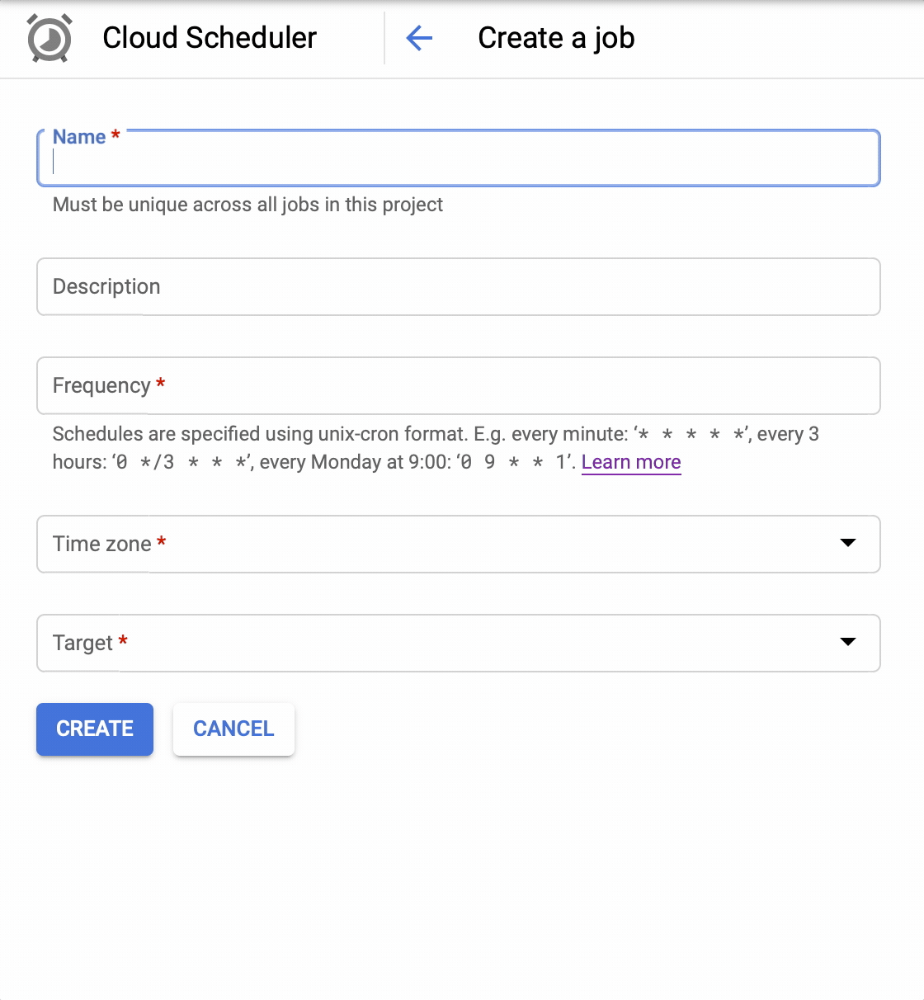

## Update Share Prices in Notion Periodically
### Using Python,  Cloud Functions,  Pub/Sub and Cloud Scheduler  



## GCP Flow:



## Setup - 3 Steps: 

## 1. Updating Variables: 

The following variabels require updating:

```
token_v2 =
page_url =
table_url =
```

## 2. Setting up Cloud Functions and Pub/Sub: 



## 3. Setting up Cloud Scheduler: 


