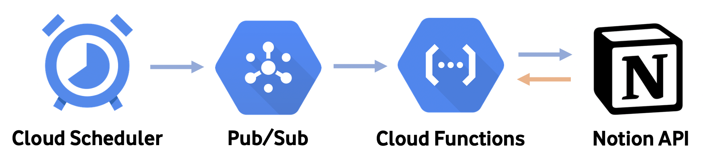

# Notion - Asset Tracker 
### Using Python and GCP Cloud Functions to Periodically Update Share Prices in Notion


## GCP Flow:



## Setup - 3 Steps: 

## 1. Updating Variables: 

The following variabels require updating:

```
token_v2 =
page_url =
table_url =
```

## 2. Setting up Cloud Functions: 


## 1. Setting up Cloud Functions: 


